<div align="center">



**Coordeno a operação logística da Multiverso Atacado — e construo o sistema que ela usa**<br/>
**Da doca ao caixa: recebimento, rota, entrega, PDV e TEF**<br/>
**Automatizo o problema que eu mesmo opero**

<p>
  <a href="mailto:albertreginato@multiversoatacado.com"></a>
  <a href="https://github.com/Albert-Reginato/aprendizado"></a>
  <!-- LINKEDIN: quando tiver o endereço, descomente a linha abaixo e troque SEU-PERFIL
  <a href="https://www.linkedin.com/in/SEU-PERFIL/"></a>
  -->
  
</p>


</div>

## 🙋‍♂️ Sobre mim

Eu não vim da computação. Vim da operação — do caminhão encostando na doca, da nota que não bate, do pedido separado errado e do cliente ligando porque a entrega não chegou.

Hoje faço as duas pontas na **Multiverso Atacado**.

**Coordeno a logística:** recebimento e armazenagem, separação e expedição, roteirização e entrega, frota e motoristas, negociação de frete e o atendimento ao RCA (o representante comercial que vende na rua) e ao cliente final. São mais de 5 anos na área e uma equipe de mais de 30 pessoas.

**E construo a tecnologia que essa operação usa:** provisionar o Windows de um PDV do zero (*golden image*), automatizar a frota de computadores das lojas, fazer impressora térmica e de etiqueta falarem a língua certa, e integrar o terminal de pagamento (**TEF**) — incluindo uma prova de conceito rodando esse mesmo TEF em **Linux**.

Essa é a parte que me interessa: eu não recebo o problema por e-mail. Eu sou quem apanha dele. Aprendo **Node.js**, **PowerShell** e **IA aplicada** resolvendo o que já está doendo na minha própria operação — é mais difícil, dá muito mais errado, e é justamente por isso que gruda.

```powershell
PS C:\multiverso> Get-Perfil -Nome "Albert" | Format-List

Nome         : Albert Reginato
Funcao       : Coordenador Logistico + Desenvolvedor
Base         : Multiverso Atacado
Operacao     : 5+ anos | 30+ pessoas na equipe
Frota        : VW Delivery 11-150 (2025/2026)
Mentor       : @cesarvcanal
Stack        : {Node.js, PowerShell, Python, Linux, IA}
MaiorForca   : Conheco o problema por dentro antes de abrir o editor
MaiorDefeito : Preciso entender por que funcionou
Cafe         : [OK] Em execucao
Status       : Automatizando o que eu mesmo opero
```

<table>
<tr>
<td width="25%" align="center">

### 🚚
**Operação de verdade**<br/>
<sub>Carga na rua, prazo correndo.<br/>Atraso aqui o cliente sente.</sub>

</td>
<td width="25%" align="center">

### 🏪
**PDV de verdade**<br/>
<sub>Loja aberta, caixa rodando.<br/>Erro aqui para a fila.</sub>

</td>
<td width="25%" align="center">

### 🤖
**Automação primeiro**<br/>
<sub>Se precisa de clique manual,<br/>ainda não está pronto.</sub>

</td>
<td width="25%" align="center">

### 📖
**Aprendizado em público**<br/>
<sub>A hipótese errada também<br/>vira registro.</sub>

</td>
</tr>
</table>


## 🚚 A operação que eu coordeno

<div align="center">


</div>

```
 ================================================
   MULTIVERSO ATACADO     ORDEM DE CARREGAMENTO
 ================================================
  EMISSOR   : Albert Reginato
  FUNCAO    : Coordenador Logistico
  VEICULO   : VW DELIVERY 11-150   2025 / 2026
  ROTA      : operacao -> codigo -> operacao
 ------------------------------------------------
  VOL   CARGA                           SITUACAO
 ------------------------------------------------
  01    Recebimento e armazenagem        [ OK ]
  02    Separacao e expedicao            [ OK ]
  03    Roteirizacao e entrega           [ OK ]
  04    Frota e motoristas               [ OK ]
  05    Negociacao de frete              [ OK ]
  06    Suporte ao RCA e ao cliente      [ OK ]
 ------------------------------------------------
  TEMPO DE CASA ..... 5+ anos de operacao
  EQUIPE ............ 30+ pessoas
  FROTA ............. VW Delivery 11-150
  AVARIA ............ 0 processo sem dono
 ================================================
   ENTREGA CONFIRMADA
   PROXIMA ROTA: AUTOMATIZAR O QUE AINDA E MANUAL
 ================================================
```

Coordenar logística é decidir com informação incompleta e prazo correndo. O caminhão não espera o relatório ficar pronto. É daí que vem quase tudo que eu levo para o código:

| Na operação | O que virou no código |
|---|---|
| Processo que depende de alguém lembrar vira falha no sábado | Automação idempotente — roda duas vezes, mesmo resultado |
| Conferência manual de carga não escala e cansa | Verificação por *hash* (impressão digital do arquivo), não por olho |
| Caminhão parado é prejuízo visível na hora | Monitoramento de frota de PCs com sinal de vida e auto-cura |
| Divergência que ninguém vê é pior que falta que todo mundo vê | Falhar alto, nunca em silêncio |


## 🧾 E a outra metade sai impressa

```
 ==========================================
          MULTIVERSO  ATACADO
      CUPOM NAO FISCAL   -   PERFIL
 ==========================================
  OPERADOR : Albert Reginato
  FUNCAO   : coord. logistico + dev
  TERMINAL : PDV-01
  MENTOR   : @cesarvcanal
  SITUACAO : caixa aberto, fila andando
 ------------------------------------------
  ITEM  DESCRICAO                    QTD
 ------------------------------------------
  001   Node.js                      1 un
  002   PowerShell                   1 un
  003   Python                       1 un
  004   Linux / Ubuntu               1 un
  005   IA aplicada                  1 un
  006   Chao de operacao (5+ anos)   1 un
  007   Curiosidade teimosa         ** un
 ------------------------------------------
  SUBTOTAL .......... 0 diploma de TI
  DESCONTO .......... 0 atalho tomado
  ACRESCIMO ......... 1 noite virada
 ==========================================
  TOTAL ......... 1 carreira em obras
 ==========================================
  PAGAMENTO  : horas de estudo
  AUTORIZADO : erro assumido em publico
  TROCO      : conhecimento, devolvido
               no diario tecnico
 ------------------------------------------
        OBRIGADO E VOLTE SEMPRE  :)
 ==========================================
```


## 🗺️ Como eu cheguei até aqui

A ordem em que os problemas apareceram — cada um puxou o próximo:

```
  CHAO DE OPERACAO
  |  5+ anos coordenando recebimento, estoque, expedicao,
  |  rota, frota, frete e atendimento ao RCA e ao cliente.
  |  Nunca tinha escrito uma linha de codigo.
  |
  +-- "Preparar um PC de caixa leva o dia inteiro"
  |      -> Provisionamento automatizado do Windows, do zero.
  |
  +-- "E os outros PCs, espalhados pelas lojas?"
  |      -> Frota: sinal de vida, auto-cura, acesso remoto.
  |
  +-- "A etiqueta sai torta e o driver nao ajuda"
  |      -> Larguei o driver e falei ZPL direto com a Zebra.
  |
  +-- "O cartao precisa passar, e a doc nao existe"
  |      -> Engenharia reversa do integrador de pagamento.
  |
  +-- "E se o caixa rodasse Linux?"
         -> TEF em Ubuntu: prova de conceito validada.
```


## 🔭 No que estou trabalhando agora

| | Frente | Situação |
|:--:|---|---|
| 🚚 | **Operação logística Multiverso** — frota, rota, expedição, frete e atendimento | Em produção, todo dia |
| 🖥️ | **Golden Image** — provisionamento automatizado de PDVs | Em produção · *repo privado* |
| 💳 | **TEF ↔ PDV em Linux/Ubuntu** | Prova de conceito validada · *repo privado* |
| 🧰 | **PowerShell + Node.js** para automação de frota | Em evolução contínua |
| 🎓 | Mentoria técnica com [@cesarvcanal](https://github.com/cesarvcanal) | Semanal |
| 📚 | [Diário técnico público](https://github.com/Albert-Reginato/aprendizado) | Atualizado a cada avanço |


## 📖 Diário técnico

Registro em **[Albert-Reginato/aprendizado](https://github.com/Albert-Reginato/aprendizado)** o problema real, a hipótese errada e a lição que ficou. Sem a parte onde eu já sabia a resposta.

| Tema | O que tem lá |
|---|---|
| 🖥️ [Golden Image](https://github.com/Albert-Reginato/aprendizado/tree/master/golden-image) | Provisionar um PC de PDV do zero, sem clique manual — e o bug de relógio que só hardware real revelou |
| ⚙️ [Automação](https://github.com/Albert-Reginato/aprendizado/tree/master/automacao) | Idempotência, integridade de arquivo por hash, serviço de verdade (NSSM) |
| 🚚 [Frota](https://github.com/Albert-Reginato/aprendizado/tree/master/frota) | Heartbeat, auto-cura de suporte remoto, recuperação de acesso |
| 🧾 [PDV / Hardware](https://github.com/Albert-Reginato/aprendizado/tree/master/pdv) | Impressora de etiqueta Zebra — do driver genérico ao ZPL puro |
| 💳 [TEF](https://github.com/Albert-Reginato/aprendizado/tree/master/tef) | Engenharia reversa do integrador de pagamento no Windows |
| 🐧 [TEF em Linux](https://github.com/Albert-Reginato/aprendizado/tree/master/linux) | `ctypes` + biblioteca nativa do fornecedor: três defeitos silenciosos encontrados e corrigidos |


## 🧠 O que a operação me ensinou e curso nenhum ensina

> **Rota no papel não é rota na rua.**
> O sistema diz que cabe, que dá tempo e que o endereço existe. O motorista, a doca e o trânsito discordam. Planejamento que não aceita correção vinda do campo é só um desejo bem formatado.

> **Falhar alto é melhor que falhar bonito.**
> Um `R$ 0,00` no cupom é feio, mas alguém vê. Um valor plausível e errado passa pelo caixa, pelo cliente e pela conferência — e só aparece no fechamento do mês.

> **Hardware não lê documentação.**
> O manual do driver dizia que imprimia. A impressora discordava. Ganhou a impressora.

> **Se depende de alguém lembrar, já quebrou.**
> Todo processo que precisa de "aí é só clicar aqui" vira chamado no sábado à noite — na loja e no depósito.


## 🛠️ Stack & Ferramentas

<div align="center">

**Linguagens e runtime**


**Sistemas e infraestrutura**


**Ferramentas do dia a dia**


</div>


## 📊 Números

<div align="center">

<table>
<tr>
<td align="center" width="25%"><h3>5+</h3><sub>anos coordenando<br/>logística</sub></td>
<td align="center" width="25%"><h3>30+</h3><sub>pessoas na<br/>operação</sub></td>
<td align="center" width="25%"><h3>3</h3><sub>sistemas em<br/>produção na loja</sub></td>
<td align="center" width="25%"><h3>0</h3><sub>diplomas de TI<br/>até agora</sub></td>
</tr>
</table>

</div>

<div align="center">



</div>

> 📌 **Cada caixa arremessada é um commit meu.** A grade da DOCA 01 tem 48 vagas:
> os 48 commits que eu fiz em outubro de 2026, em 5 repositórios. A maior parte
> mora em repositório privado, porque é infraestrutura real de loja — caixa aberto
> e cliente na fila. O GitHub conta o volume, mas não mostra onde foi parar.
> O [diário técnico](https://github.com/Albert-Reginato/aprendizado) é onde
> mostro como penso construindo isso.

<!--
  TEXTO ANTERIOR, guardado caso eu queira voltar atras:

  > 📌 **Por que não tem gráfico de contribuição aqui:** meus commits moram em
  > repositórios privados — é infraestrutura real de loja, com caixa aberto e
  > cliente na fila. Os contadores automáticos do GitHub só enxergam o que é
  > público, então mostrariam zero e mentiriam a meu respeito.
  > O [diário técnico](https://github.com/Albert-Reginato/aprendizado) é onde
  > mostro como penso construindo isso.

  Deixou de valer em 08/10/2026: a opcao "incluir contribuicoes privadas no
  perfil" foi ligada, e o grafico do GitHub passou a mostrar 113 contribuicoes
  em vez de zero.
-->

<!--
  PARA RELIGAR OS CARTOES AUTOMATICOS:
  quando houver repositorio publico com codigo, basta descomentar o bloco
  abaixo. Hoje ele mostraria 0 commits, 0 estrelas e "No languages data".

  
  
  

  NAO usar o parametro include_all_commits=true: ele faz o cartao falhar com
  "Something went wrong - Could not fetch total commits". Testado em 07/10/2026.
-->

<!--
  LOGO OFICIAL DA EMPRESA:
  salve o arquivo da logo nova em  assets/logo-multiverso.png  e descomente
  a linha abaixo para exibi-la. Enquanto o arquivo nao existir, a linha fica
  comentada para nao aparecer imagem quebrada no perfil.

  <div align="center"></div>
-->


<div align="center">

### 📬 Vamos conversar

Se você tem um problema chato de operação, de loja, de automação ou de hardware teimoso — esse é o meu tipo favorito de conversa.

<a href="mailto:albertreginato@multiversoatacado.com"></a>

<br/><br/>

<i>Quem opera o problema todo dia tem uma vantagem injusta na hora de resolvê-lo.<br/>Eu só resolvi aprender a escrever a solução também.</i>


</div>

<!--
  Chegou a abrir o codigo-fonte deste README? Essa curiosidade
  e exatamente o que me trouxe ate aqui. Manda um e-mail. :)
-->
